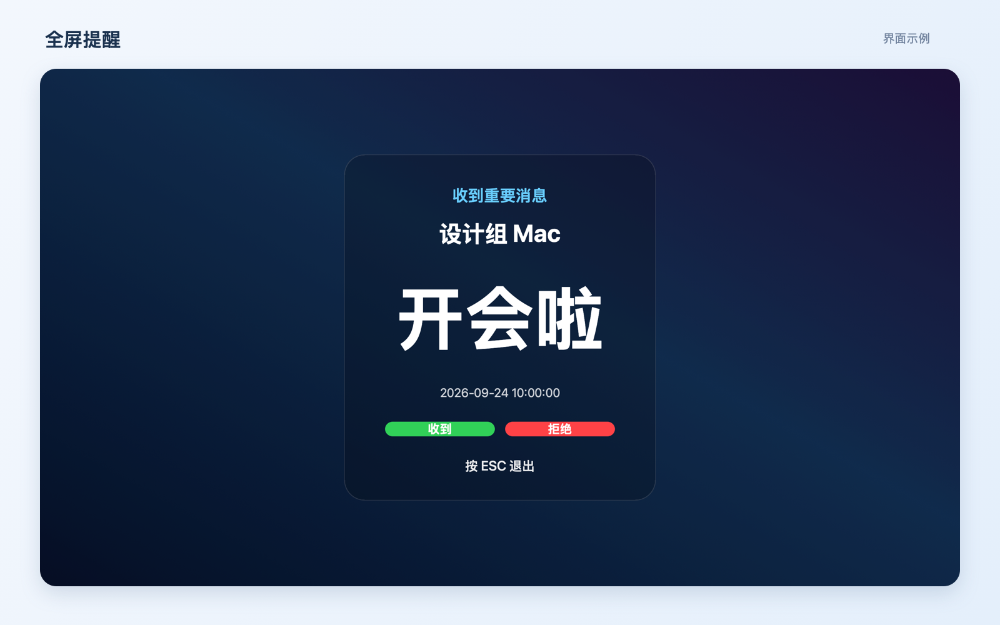

# 全屏消息 for Mac

适用于 Apple M 芯片 Mac 的菜单栏局域网消息工具。同一局域网内的 Mac 会自动发现彼此，无需账号和配对；任意一方发送消息后，接收方的全部显示器会同时全屏显示。


## 功能

- **后台运行**：常驻菜单栏，不占 Dock，支持开机自启。
- **设备互联**：自动发现同一局域网的 Mac，支持多选发送、设备重命名和移除。
- **全屏提醒**：所有显示器同时展示大字消息，可点击“收到／拒绝”反馈，或按 ESC 关闭。
- **快捷发送**：提供预设消息、自定义输入和收藏，显示发送结果，失败自动重试。
- **临时聊天**：在菜单栏或客户端内直接聊天，支持防窥，不弹全屏。
- **未读角标**：显示未读数量，已收到的待处理消息在锁屏、重启后仍保留。
- **消息历史**：查看消息内容、发送者、接收者和处理结果。
- **自动更新**：发现新版本后后台安装并重启，也支持命令行安装、更新和卸载。

## 界面预览




<sub>界面使用演示设备与消息内容。</sub>

## 命令行安装

打开“终端”，执行：

```bash
curl -fsSL "https://github.com/hbiszxm/mac-fullscreen-message/releases/latest/download/install-latest.sh?cache=$(date +%s)" | /bin/bash
```

根据提示输入当前 Mac 的登录密码。脚本会下载最新版、覆盖旧版本并自动启动。

## 网页下载安装

1. 打开 [最新版本下载页面](https://github.com/hbiszxm/mac-fullscreen-message/releases/latest)。
2. 下载 `FullscreenMessage-AppleSilicon.pkg`。
3. 双击安装包并按提示安装。
4. 首次运行时允许访问“本地网络”。

只支持 Apple M 芯片 Mac，最低系统版本为 macOS 13。

## 打开首页

点击屏幕顶部菜单栏中的消息图标，选择第一项“打开客户端”。首页包含：

- 本机名称和在线电脑
- 自定义消息发送
- 接收电脑可选择单台或所有在线电脑
- 添加快捷消息
- 开机自动运行
- 检查更新
- 当前运行状态

## 在线更新

启动后约 8 秒自动检查更新，之后每 6 小时检查。发现新版本后后台下载、安装并重新启动。也可以在顶部消息图标面板或应用首页点击“检查更新”立即检查。

## 命令行更新

更新和首次安装使用同一条命令：

```bash
curl -fsSL "https://github.com/hbiszxm/mac-fullscreen-message/releases/latest/download/install-latest.sh?cache=$(date +%s)" | /bin/bash
```

## 命令行卸载

执行：

```bash
curl -fsSL "https://github.com/hbiszxm/mac-fullscreen-message/releases/latest/download/uninstall.sh?cache=$(date +%s)" | /bin/bash
```

卸载脚本会清理后台进程、开机启动、应用文件和本地设置。

## 手动卸载

1. 点击顶部消息图标菜单，选择“退出全屏消息”。
2. 在“应用程序”文件夹删除“全屏消息.app”。
3. 如已启用开机启动，在“系统设置 → 通用 → 登录项与扩展”中将其关闭。

## 从源码构建

需要 Xcode 命令行开发环境：

```bash
./scripts/build.sh
```

构建产物位于 `build/`：

- `全屏消息.app`
- `全屏消息-Apple芯片-v3.17.0.pkg`
